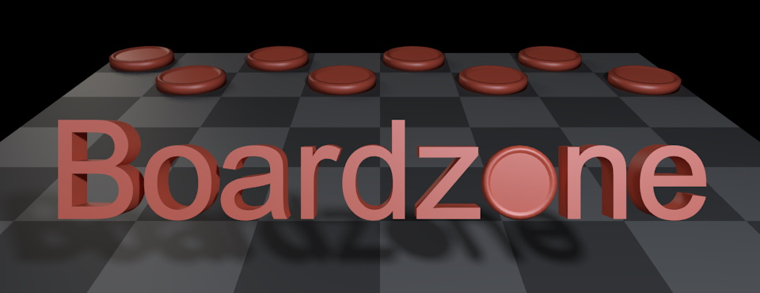

# Boardzone

## Project Properties
- Author: James Motherwell
- Class: SDEV 372
- Winter 2024

## Milestones
- [x] Project creation
- [x] Writing a Web API
- [x] Consuming a Web API
- [x] Deploying to the Cloud

## Project Description
I aim to create a web application where the user may play a variety of board games against an AI opponent,
or against other players.

As of the time of writing, I intend to implement checkers over the coming months, using the
[minimax algorithm](https://en.wikipedia.org/wiki/Minimax) to implement AI opponents.

Moves by AI opponents will be chosen on the backend, and communicated to the frontend via a web API.

## API Documentation
Documentation for the API may be found [here](https://documenter.getpostman.com/view/32287802/2s9YytfKpb)
(last updated 1/30/2024.)